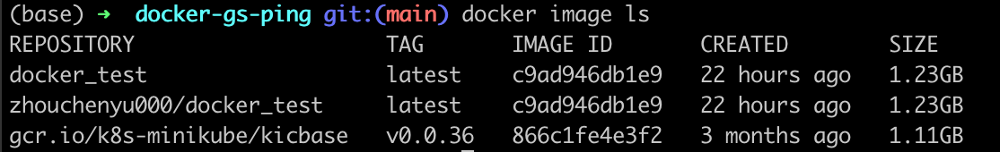
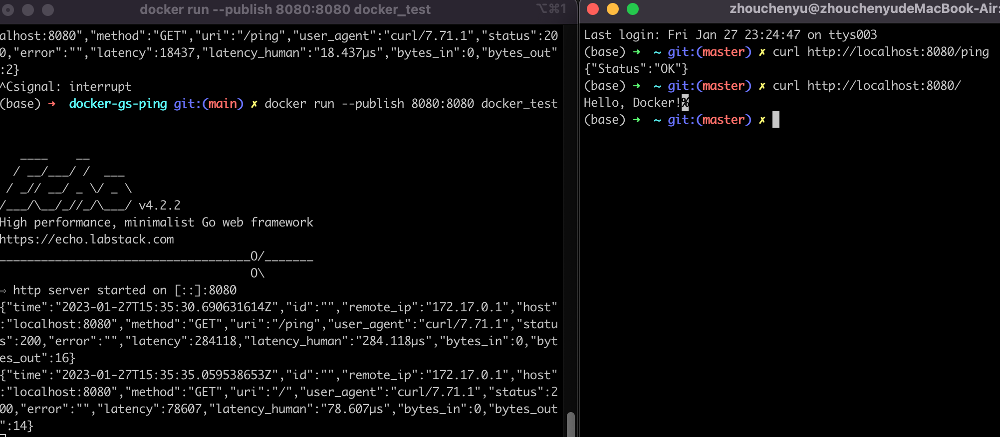

# Practice Docker 

First, We have a sample golang application
```go
package main

import (
	"net/http"
	"os"

	"github.com/labstack/echo/v4"
	"github.com/labstack/echo/v4/middleware"
)

func main() {

	e := echo.New()

	e.Use(middleware.Logger())
	e.Use(middleware.Recover())

	e.GET("/", func(c echo.Context) error {
		return c.HTML(http.StatusOK, "Hello, Docker!")
	})

	e.GET("/ping", func(c echo.Context) error {
		return c.JSON(http.StatusOK, struct{ Status string }{Status: "OK"})
	})

	httpPort := os.Getenv("HTTP_PORT")
	if httpPort == "" {
		httpPort = "8080"
	}

	e.Logger.Fatal(e.Start(":" + httpPort))
}

```

然後 新增Dockerfile
```txt
FROM golang:latest

WORKDIR /app

COPY go.mod .
COPY go.sum .
RUN go mod download

COPY *.go ./

RUN go build -o /docker-test

EXPOSE 8080

CMD [ "/docker-test" ]
```

Build Image
```cmd
docker build --tag docker_test .
```

Check Image
```cmd
docker image ls
```
  

Run Image
```cmd
docker run --publish 8080:8080 docker_test  
curl http://localhost:8080/
```

 

